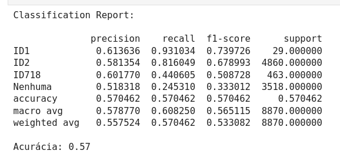
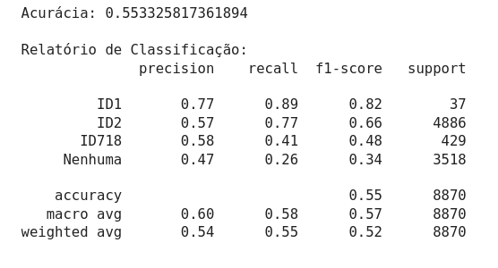

### **Modelo Inicial**

#### **Random Forest:**

O primeiro modelo implementado foi o **Random Forest**,  uma técnica de aprendizado supervisionado que combina múltiplas árvores de decisão para melhorar a capacidade preditiva e reduzir o risco de overfitting. 

:::danger
O **Random Forest** foi inicialmente implementado à pedido do parceiro, que solicitou um modelo de classificação 
:::

Neste projeto, o modelo foi treinado utilizando as features selecionadas durante a fase de preparação dos dados. O treinamento incluiu features como `TOTAL OK`, `TOTAL NOK`, `RESULTADO`, além das novas features relacionadas ao status dos componentes (por exemplo, `ID1 S OK`, `ID2 S OK`, etc.). A escolha dessas features visou maximizar a informação relevante disponível para o modelo.

Após o treinamento, o desempenho do Random Forest foi avaliado utilizando uma matriz de confusão. Os resultados mostraram que o modelo se saiu bem em classificar corretamente o componente **ID1**, com alta precisão. No entanto, o modelo apresentou dificuldades significativas em distinguir entre as classes **ID2** e **Nenhuma**, o que resultou em uma confusão considerável entre essas categorias. Esse problema é indicativo de que as classes compartilham características semelhantes ou que os dados disponíveis não capturam bem as diferenças entre elas.

A acurácia geral do modelo foi de **57%**, um valor que indica um desempenho modesto, mas que também aponta para a necessidade de melhorias. A precisão variou conforme a classe, com algumas classes apresentando um desempenho significativamente melhor que outras. Este resultado destaca a importância de continuar refinando as features ou ajustando os hiperparâmetros do modelo para melhorar a discriminação entre classes mais problemáticas. Todavia, para um modelo primário com um curto período de tempo as métricas estão na média.

---
Figura 1: Métricas do modelo Random Forest

Autor: criação própria (2024)

---

---
Figura 2: Matriz de confusão do modelo Random Forest

Autor: criação própria (2024)

---

#### **K-Nearest Neighbors (KNN):**

Para complementar a análise e oferecer uma perspectiva diferente sobre a classificação dos dados, foi implementado um modelo de **K-Nearest Neighbors (KNN)**. O KNN é uma técnica de aprendizado supervisionado que classifica os dados com base na proximidade com os exemplos de treinamento mais próximos. É conhecido por sua simplicidade e intuição, sendo útil especialmente em casos onde a relação entre as variáveis e as classes não é linearmente separável.

No entanto, o KNN também tem suas limitações, particularmente quando há um grande número de features ou quando as classes estão sobrepostas, como parecia ser o caso neste dataset. 

Após o treinamento, o KNN foi avaliado utilizando uma matriz de confusão. Os resultados mostraram que o modelo teve um bom desempenho em identificar corretamente a classe **ID1**, o que é consistente com a performance do Random Forest nessa mesma classe. Contudo, o KNN enfrentou dificuldades ainda maiores ao tentar diferenciar entre as classes **ID2** e **Nenhuma**. Houve uma alta taxa de falsos positivos para a classe **ID2**, sugerindo que o modelo frequentemente confundia essa classe com **Nenhuma**.

Este comportamento pode ser atribuído à natureza do algoritmo KNN, que tende a ser mais sensível a sobreposições entre classes, especialmente quando a métrica de distância usada para definir a proximidade entre os pontos não consegue capturar bem as nuances dos dados. Além disso, o KNN pode ser particularmente afetado por ruídos e outliers no dataset, o que pode ter contribuído para a alta taxa de erro observada.

:::danger
O **KNN** e outros modelos não supervisionados não serão aplicados no projeto por conta do escopo, este modelo primário foi apenas uma análise em outra perspectiva
:::

---
Figura 3: Métricas do modelo KNN

Autor: criação própria (2024)

---

---
Figura 4: Matriz de confusão do modelo KNN

Autor: criação própria (2024)

---

#### **Avaliação e Comparação dos Modelos:**

A comparação entre os dois modelos revelou que ambos enfrentaram desafios significativos ao tentar diferenciar as classes **ID2** e **Nenhuma**. Esse padrão sugere que o problema pode não ser apenas uma questão de modelagem, mas sim algo intrínseco aos dados. As classes podem compartilhar características muito semelhantes, ou as features disponíveis podem não estar capturando informações suficientemente discriminativas para separar corretamente essas categorias.

Para abordar essas limitações, algumas estratégias podem ser consideradas nas próximas etapas do projeto:

1. **Ajustes de Hiperparâmetros:** Tanto no Random Forest quanto no KNN, uma afinação mais cuidadosa dos hiperparâmetros poderia ajudar a melhorar o desempenho. No caso do Random Forest, o ajuste no número de árvores, na profundidade máxima das árvores, ou na seleção das features a cada split pode ser explorado. Para o KNN, experimentar diferentes valores de k e métricas de distância poderia ajudar a mitigar o problema de sobreposição entre classes.

2. **Criação de Novas Features:** Considerando que a diferenciação entre **ID2** e **Nenhuma** foi um desafio, pode ser útil revisitar a criação de features. Features adicionais que capturem mais nuances nos dados ou que utilizem técnicas avançadas de engenharia de features podem ajudar a melhorar a separação entre essas classes.

3. **Técnicas de Balanceamento de Classes:** Técnicas como **SMOTE** (Synthetic Minority Over-sampling Technique) ou outras formas de balanceamento de classes podem ser úteis para lidar com possíveis desequilíbrios nos dados, garantindo que o modelo não seja tendencioso para classes majoritárias.

Em resumo, embora tanto o Random Forest quanto o KNN tenham fornecido uma base inicial sólida para a classificação, os resultados indicam que há espaço significativo para melhorias. A comparação entre os modelos proporcionou uma compreensão mais profunda das capacidades e limitações de cada abordagem, guiando as decisões para as próximas etapas do projeto. A busca por melhores resultados envolve não apenas ajustes técnicos, mas também uma análise mais profunda dos dados e das características que eles apresentam.