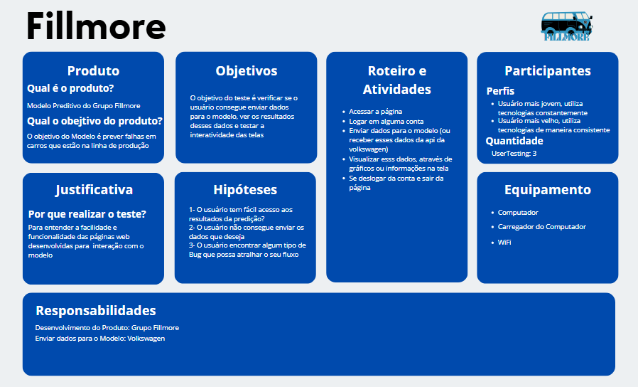

# Canvas de Planejamento de Testes

O Canvas de Planejamento de Testes é uma ferramenta visual projetada para auxiliar no planejamento e organização dos elementos necessários para a execução de um teste. No contexto do Modelo Preditivo do Grupo Fillmore, esse canvas serve para estruturar o teste do sistema de previsão de falhas em veículos que estão na linha de produção, avaliando a interação dos usuários com as páginas desenvolvidas para inserção e visualização de dados.

## A importância do Canvas no Teste do Modelo Preditivo

Esse teste busca garantir que o sistema desenvolvido seja intuitivo e eficiente para os operadores da linha de produção e para os gerentes, validando a interface do usuário e a funcionalidade de envio e visualização de dados. A realização de um teste bem-estruturado permite que o produto final atenda às expectativas de precisão e usabilidade necessárias para um ambiente industrial.

Segue uma Imagem do Canvas:

[Canvas de Planejamento de Testes](https://www.canva.com/design/DAGS45mWxd8/puxsZgajr1m8l6xs-7VhcQ/edit?utm_content=DAGS45mWxd8&utm_campaign=designshare&utm_medium=link2&utm_source=sharebutton)

## Estrutura do Canvas de Teste

### 1. Produto

O produto que está sendo testado é o Modelo Preditivo do Grupo Fillmore, que visa prever falhas em carros ainda na linha de produção. Esse modelo depende de dados inseridos pelo usuário ou extraídos da API da Volkswagen para fornecer previsões e facilitar a tomada de decisões no processo de produção.

### 2. Objetivos

O principal objetivo deste teste é verificar se os usuários conseguem interagir com o sistema de maneira eficiente e se o modelo processa e apresenta os dados corretamente. Além disso, busca-se avaliar a interatividade das telas e a facilidade de navegação, garantindo que os usuários possam enviar e visualizar dados sem dificuldades.

### Objetivos específicos:

- Validar a usabilidade da interface.
- Garantir que o envio de dados para o modelo funcione corretamente.
- Testar se os resultados das previsões são facilmente acessíveis pelos usuários.

### 3. Justificativa

A realização deste teste é crucial para entender a facilidade e a funcionalidade das páginas web que foram desenvolvidas para interagir com o modelo preditivo. Sem essa validação, corre-se o risco de que a solução final não seja prática para os operadores, gerando falhas na coleta ou interpretação dos dados.

### Por que realizar o teste?

- Para garantir que os operadores da linha de produção e gerentes de qualidade consigam utilizar o sistema com facilidade.
- Para assegurar que o modelo preditivo seja eficiente na previsão de falhas e permita uma rápida visualização dos resultados.

### 4. Hipóteses

As hipóteses que o teste busca validar são:

1. O usuário terá fácil acesso aos resultados da previsão.
2. O usuário não encontrará dificuldades para enviar os dados necessários ao modelo.
3. O sistema não apresentará nenhum tipo de bug que cause o travamento da interface ou problemas de navegação.

### 5. Roteiro e Atividades

O teste segue um roteiro bem definido para garantir que todas as funcionalidades principais do sistema sejam verificadas. As etapas incluem:

1. Acessar a página: O usuário deverá acessar a interface web do sistema.
2. Logar em uma conta: O usuário precisará fazer login para garantir a segurança no envio de dados.
3. Enviar dados ao modelo (ou receber dados da API da Volkswagen): O usuário irá submeter dados de um veículo para que o modelo faça previsões.
4. Visualizar os dados: O usuário verá os dados processados pelo modelo, exibidos em gráficos ou outras formas visuais.
5. Sair da conta: Ao finalizar, o usuário deverá sair da conta com segurança, garantindo a integridade dos dados e do sistema.

### 6. Participantes

Os participantes do teste foram selecionados para representar diferentes perfis de usuários do sistema:

- Perfil Jovem: Um usuário que utiliza tecnologias frequentemente.
- Perfil Experiente: Um usuário mais velho, que usa tecnologia, mas com uma experiência mais limitada e consistente.

A quantidade de participantes será de 3.

### 7. Equipamento

Para a realização do teste, os seguintes equipamentos serão utilizados:

- Computador: O sistema será acessado via um computador, simulando o ambiente de trabalho dos operadores.
- Carregador do computador: Para garantir que o equipamento não falhe durante o teste.
- Wi-Fi: Conexão estável à internet para acessar as páginas e interagir com a API da Volkswagen.

### 8. Responsabilidades

As responsabilidades estão divididas da seguinte forma:

- Desenvolvimento do Produto: Grupo Fillmore – Responsável pelo desenvolvimento da interface e do modelo preditivo.
- Integração com a API da Volkswagen: O grupo responsável pelo modelo deve garantir que a comunicação com a API funcione corretamente, recebendo e enviando os dados necessários.

## Conclusão

O Canvas de Planejamento de Testes para o Modelo Preditivo do Grupo Fillmore foi desenvolvido para garantir que o sistema seja testado de maneira organizada, cobrindo todas as principais funcionalidades e verificando a experiência do usuário final. O teste é fundamental para validar a usabilidade e a eficiência do modelo, garantindo que ele esteja pronto para ser implementado na linha de produção e ajude a prever falhas nos veículos com precisão e agilidade.

Devido a questões de prazo de entrega do projeto, não foi possível realizar todos os testes de forma abrangente. Sendo assim, fica sugerido que a Volkswagen conduza testes adicionais para validar o sistema em ambiente real, garantindo que o modelo funcione conforme o esperado na linha de produção.

